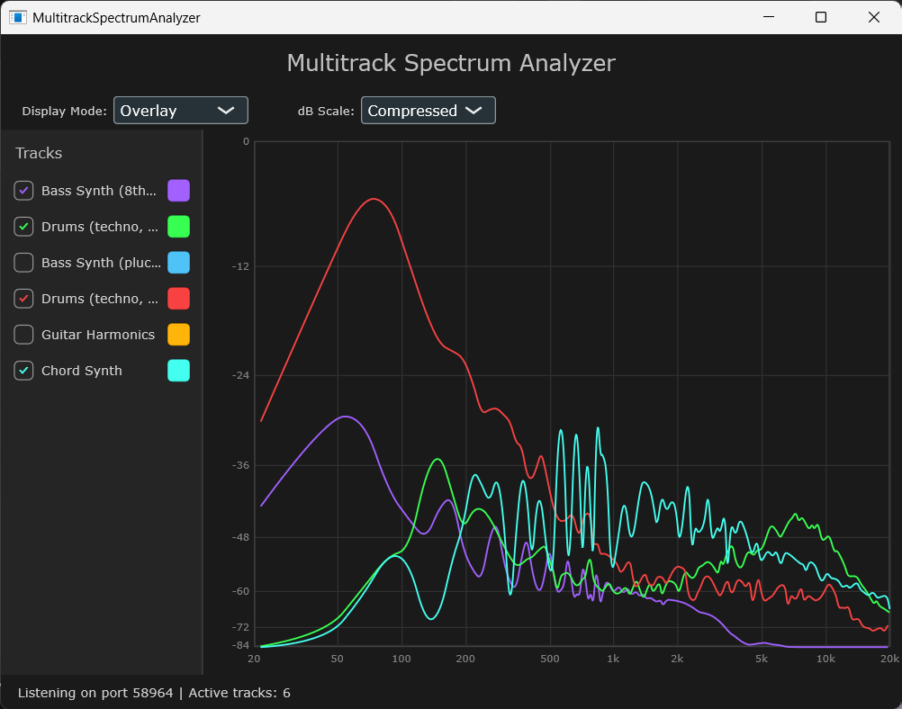
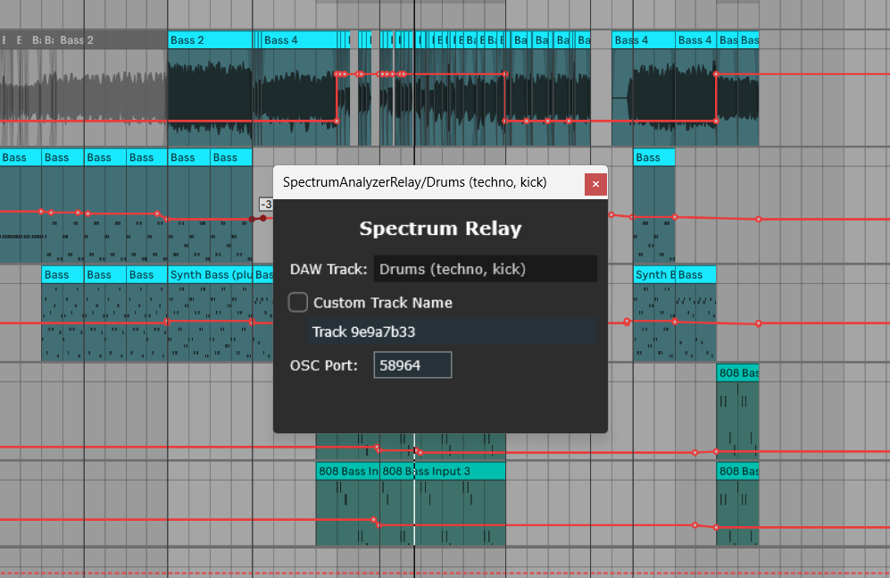

# wxc-spectrum-analyzer

This project consists of a VST plugin that performs spectrum analysis on individual tracks, and a standalone GUI application that displays data from instances of the plugin. 

## Features

- **Real-time spectrum analysis**: Displays the frequency spectrum of audio signals in real-time.
- **Automatic track detection**: The MultitrackSpectrumAnalyzer application automatically detects any active instances of the SpectrumAnalyzerRelay plugin. No hard limits on track count, and no manual DAW routing required.
- **Track management**: Users can toggle visibility of individual tracks and customize their colours.
- **Display modes**: The spectrum data can be displayed overlaid, or as a summed spectrum. The y-axis scale can also be customized.

## Technical Details

The plugin and main application are built with JUCE. Track detection and spectrum data transfer are handled via OSC (Open Sound Control).